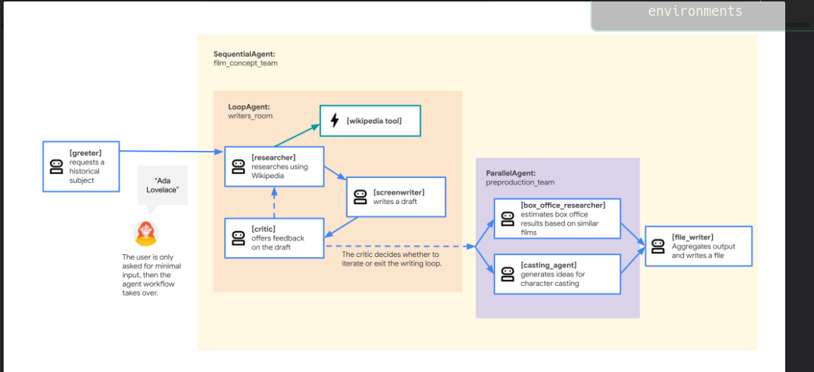
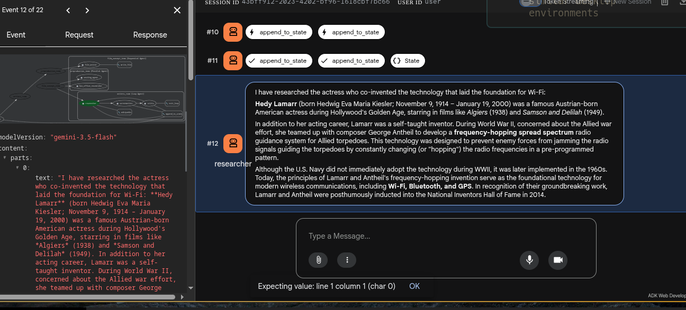
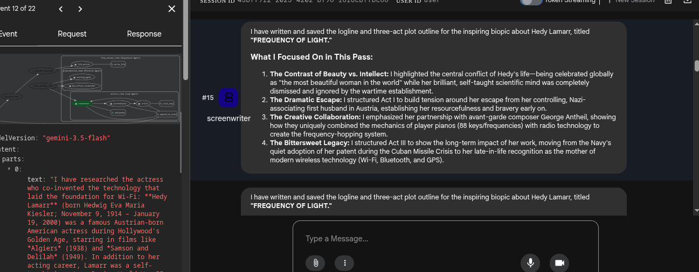
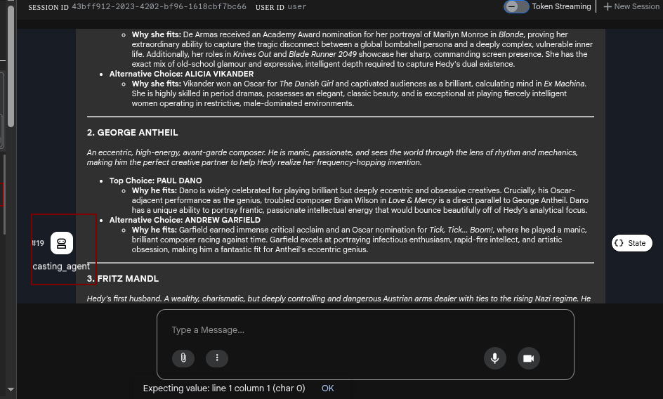
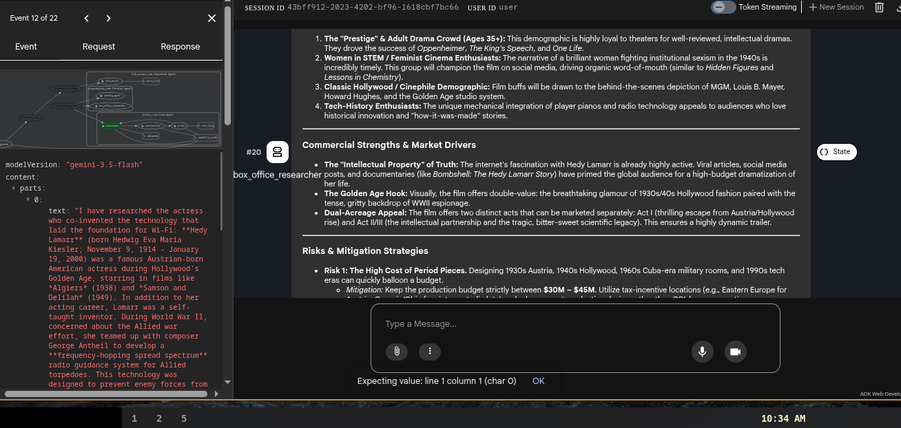

# Multiagent System Examples

This repository contains example ADK-based multiagent setups and utilities used for teaching and experimentation.

Quick structure

- `adk_multiagent_systems/` — example agent configurations and apps
  - `workflow_agents/agent.py` — a movie-pitch writing workflow using Sequential/Loop/Parallel agents
  - `parent_and_subagents/agent.py` — parent agent with subagents for travel planning
- `adk_utils/` — small utility plugins

## Architecture & Workflow

1. Agent architecture — `SequentialAgent` (`film_concept_team`) driving the `writers_room` `LoopAgent` (researcher/screenwriter/critic) into the `preproduction_team` `ParallelAgent` (box office researcher + casting agent), aggregated by `file_writer`.

   

2. `researcher` step in the ADK web dev UI, pulling background on the historical subject via the Wikipedia tool.

   

3. `screenwriter` step producing the logline and three-act plot outline from the research.

   

4. `casting_agent` step suggesting cast choices for the lead roles.

   

5. `box_office_researcher` step analyzing market drivers and commercial risk for the pitch.

   

Getting started

1. Create a Python virtual environment and install dependencies:

```bash
python -m venv .venv
source .venv/bin/activate
pip install -r adk_multiagent_systems/requirements.txt
```

2. Create a `.env` file (copy `.env.example`) and set `MODEL` to your model identifier.
3. Run an example agent directly:

```bash
# Run the workflow agents example
python adk_multiagent_systems/workflow_agents/agent.py

# Or run the parent/subagents example
python adk_multiagent_systems/parent_and_subagents/agent.py
```

Notes

- These examples reference the Google ADK (`google.adk`) and other platform-specific SDKs. Ensure the required SDKs are installed and authenticated.
- The repository includes a `.gitignore` preconfigured to ignore local caches and secrets (e.g., `.local/`, `.npm/`, `.env`, shell histories).
